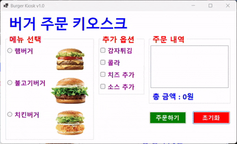
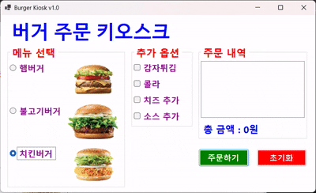

# (C# 코딩) 카오스크 주문 화면

## 개요
- C# 프로그래밍 학습
- 1줄 소개: 키오스크 주문 화면
- 사용한 플랫폼: 
  -C#, .NET Windows Forms, Visual Studio, GitHub
- 사용한 컨트롤:
  - Label, CheckBox, RadioButton, Button, GroupBox, PictureBox, ListBox
- 사용한 기술과 구현한 기능:
  - RadioButton을 활용한 단일 메뉴 선택
  - CheckBox를 활용한 복수 선택 처리
  - 선택된 항목들의 가격을 합산
  - 버튼 클릭 시 전체 로직 실행
  - 선택 여부에 따른 분기 처리
  - 사용자 입력에 따라 화면 즉시 반영

## 실행 화면 (과제1)
- 코드의 스크린샷과 구현 내용 설명

- 구현한 내용(위 그림 참조)
  - UI 구성 : RadioButton과 Check Box 등을 적절히 배치, GroupBox로 적절하게 그룹으로 묶음
  - 주문 내역과 총 금액을 표시
  - 다시 주문할 수 있도록 초기화

## 실행 화면 (과제2)
- 코드의 스크린샷과 구현 내용 설명

- 구현한 내용(위 그림 참조)
  - 아무것도 선택하지 않은 상태에서 주문하기 버튼을 누르면 사용자가 메뉴를 선택하지 않고 주문 버튼을 눌렀다면
	MessageBox대신에 Label을 사용해 화면에 에러 메시지를 분명하고 보기 쉽게 표시
  - 총 금액을 표시할 때 천원 단위로 콤마(,)를 추가하여 가독성 향상
  - 처음에 라디오 버튼과 체크 박스가 모두 선택되지 않은 상태로 시작하도록 초기화하여
	사용자가 명확하게 선택할 수 있도록 개선

## 실행 화면 (과제3)
- 코드의 스크린샷과 구현 내용 설명

- 구현한 내용(위 그림 참조)
  - 마우스 없이 키보드 입력만으로 주문이 가능하게 만들기
  - Tab을 이용해서 GroupBox 사이를 이동하기
  - 방향키를 이용해서 선택 아이템 사이를 이동하기
  - 스페이스바를 이용해서 아이템 선택하기
  - Enter키로 버튼 누르기
	
## 실행 화면 (과제4)
- 코드의 스크린샷과 구현 내용 설명

- 구현한 내용(위 그림 참조)
  - Radiobutton과 CheckBox에서 원하는 항목을 선택하면 그 즉시 정보들이 업데이트해 보기 편하게 만들기
  - 선택하는 순간 ListBox에 주문내역 표시가 되게하기
  - 선택하는 순간 Label에 전체 가격정보가 표시가 되게하기
